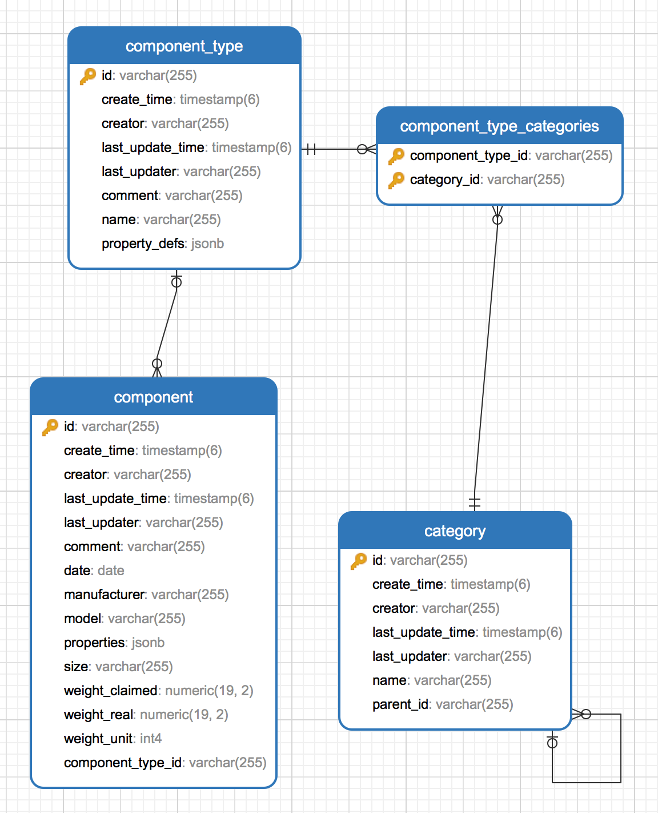

# Wiki-Api

Wiki-api is a rest api which provides extensible api for making bike wiki.

## TODO

- [ ] category api
- [ ] component type api
- [ ] concrete component api
- [ ] components compatibility api
- [ ] blueprint api

## Database design

### ComponentType 零件类型

零件类型，包含零件类型名称和该零件类型的特殊属性等，一个零件类型可对应多个零件

### Component 零件

零件表，存储零件，关联一个零件类型,包含零件基础信息，如尺寸、重量、厂商、年份等

### Category 目录

零件目录，目录下可包含若干子目录和若干零件类型
